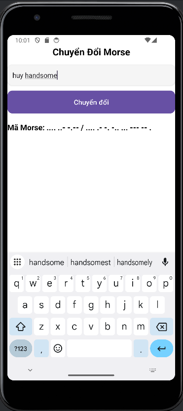

## Features

- Convert text to Morse code and vice versa.
- Display Morse code through a flashing light:
  - Accepts a Morse code string (consisting of dots (.) and dashes (-)), then flashes the light according to the Morse code:
    - Dot (.): The light flashes on for 200ms and off for 200ms. The total duration of a dot is 500ms.
    - Dash (-): The light flashes on for 600ms and off for 600ms. The total duration of a dash is 1300ms.
    - Character spacing: After each dot or dash, there is a 300ms pause to distinguish between characters in Morse code.
- Additionally, I am currently working on developing the functionality to play Morse code sound and recognize Morse code from audio.

### Preview:
Text to morse: 
 
Morse to Text (separated by " / "): 

